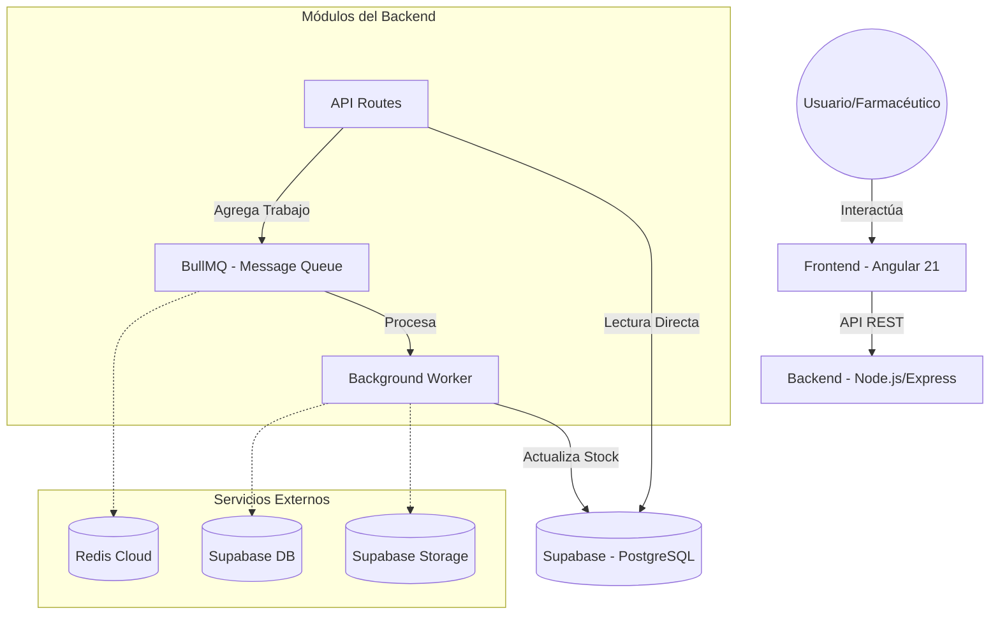

# 🏛️ Arquitectura del Sistema - FARMABOL

## 1. Estilo Arquitectónico: Monolítico Modular
Para este proyecto hemos elegido un estilo **Monolítico Modular**.

### Justificación:
- **Simplicidad de Despliegue:** Al ser un proyecto para una evaluación con tiempo limitado, un monolito modular permite desplegar toda la lógica del backend en una sola instancia (Render), facilitando la gestión.
- **Bajo Acoplamiento:** Aunque es un monolito, el código está organizado por módulos (rutas, controladores, servicios/configuración), lo que permite que en el futuro se pueda escalar a microservicios si fuera necesario.
- **Escalabilidad suficiente:** Para una cadena de farmacias local, un monolito bien estructurado puede manejar miles de transacciones sin la complejidad de red de los microservicios.

## 2. Diagrama de Arquitectura (Conceptual)

## 3. Middleware: Cola de Mensajes (BullMQ)
Hemos implementado una cola de mensajes para el **registro de ventas**.
- **Problema que resuelve:** El registro de una venta implica varias operaciones (guardar venta, descontar stock, verificar alertas de stock bajo). Hacer esto de forma síncrona puede aumentar la latencia de respuesta al usuario.
- **Solución:** La API responde inmediatamente "Venta Recibida" y delega el procesamiento pesado a un Worker en segundo plano. Esto asegura que el sistema sea responsivo incluso bajo carga.
