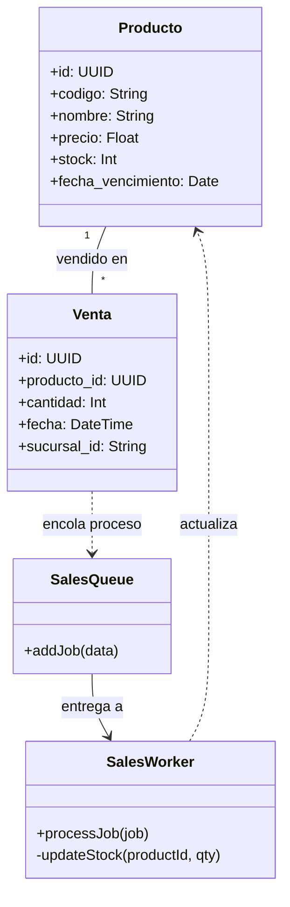
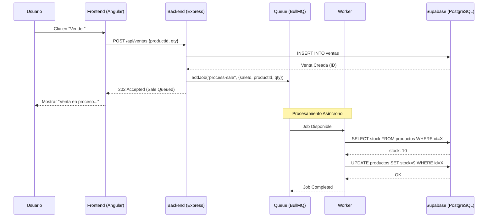

# 📐 Modelos UML - FARMABOL

## 1. Diagrama de Clases (Simplificado)

```mermaid
classDiagram
    class Producto {
        +id: UUID
        +codigo: String
        +nombre: String
        +precio: Float
        +stock: Int
        +fecha_vencimiento: Date
    }

    class Venta {
        +id: UUID
        +producto_id: UUID
        +cantidad: Int
        +fecha: DateTime
        +sucursal_id: String
    }

    class SalesQueue {
        +addJob(data)
    }

    class SalesWorker {
        +processJob(job)
        -updateStock(productId, qty)
    }

    Producto "1" -- "*" Venta : vendido en
    Venta ..> SalesQueue : encola proceso
    SalesQueue --> SalesWorker : entrega a
    SalesWorker ..> Producto : actualiza
```

## 2. Diagrama de Secuencia: Registro de Venta

```mermaid
sequenceDiagram
    participant U as Usuario
    participant F as Frontend (Angular)
    participant B as Backend (Express)
    participant Q as Queue (BullMQ)
    participant W as Worker
    participant DB as Supabase (PostgreSQL)

    U->>F: Clic en "Vender"
    F->>B: POST /api/ventas {productId, qty}
    B->>DB: INSERT INTO ventas
    DB-->>B: Venta Creada (ID)
    B->>Q: addJob("process-sale", {saleId, productId, qty})
    B-->>F: 202 Accepted (Sale Queued)
    F-->>U: Mostrar "Venta en proceso..."
    
    Note over Q,W: Procesamiento Asíncrono
    Q->>W: Job Disponible
    W->>DB: SELECT stock FROM productos WHERE id=X
    DB-->>W: stock: 10
    W->>DB: UPDATE productos SET stock=9 WHERE id=X
    DB-->>W: OK
    W-->>Q: Job Completed
```
